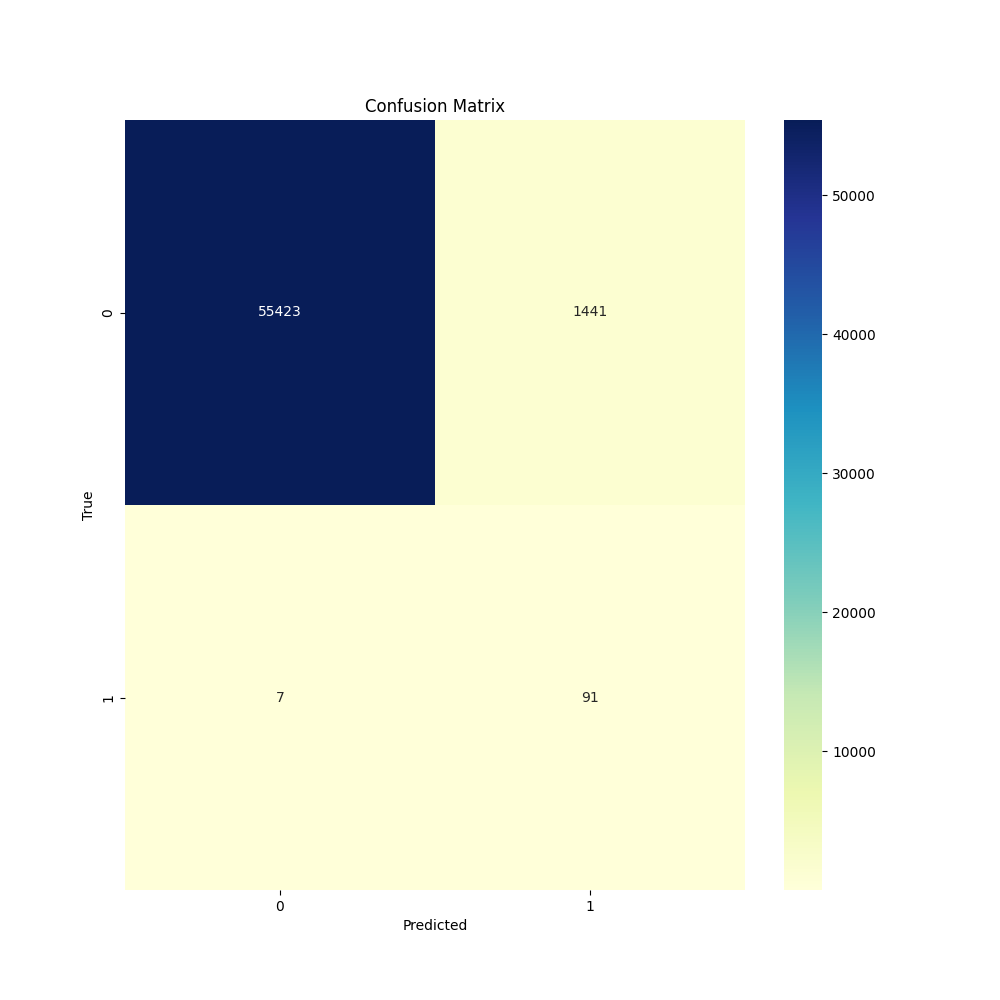

# Detección de Fraude en Tarjetas de Crédito

## Descripción 
Este proyecto utiliza ténicas de machine learning para detectar fraudes en un dataset de tarjetas de crédito. El modelo creado maximiza la detección de fraudes (recall) mientras se manejan datos desbalanceados.

### Dataset
Puedes encontrar el dataset en la carpeta 'Data' o en el siguiente enlace: [Credit Card Fraud Detection](https://www.kaggle.com/datasets/mlg-ulb/creditcardfraud).

### Metodología
1. **Preprocesamiento**: Se estandarizaron las columnas numéricas ('Amount, 'Time) y se aplico la ténica SMOTE para tratar el desbalanceo.
2. **Modelo**: Se entrenó un modelo Logistico
3. **Evaluación**: Se obtuvo la matriz de confusión, Recall, Presición, AUC-ROC

### Visualizaciones
- **Matriz de Confusión**:
  
- **Curva ROC**:
  

  Autor:
  Luis Hector Camarillo Amador - 24 de Abril del 2025
